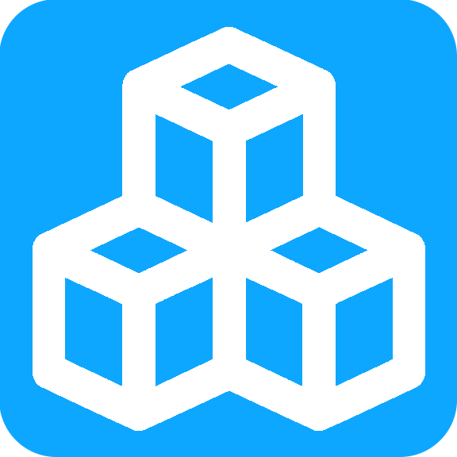
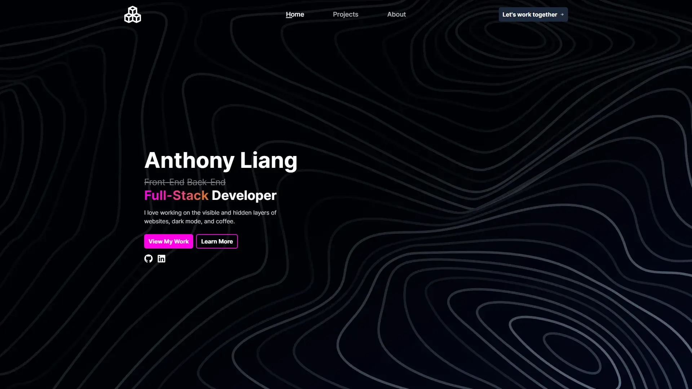

<!-- PROJECT LOGO -->
<div align="center">
  <a href="https://github.com/cyanChill/portfolio-v5">
    
  </a>
  <h1>Anthony Liang</h3>
  <p>
    Full-Stack Developer
    <br />
    <a href="https://cyanchill.com"><strong>View it Live »</strong></a>
  </p>
</div>



## Running Locally in Development Mode

To get started, clone the repository, install the dependencies, and start up the development server:

```bash
git clone https://github.com/cyanChill/portfolio-v5.git
npm install
npm run dev
```

The development server will run on [http://localhost:3000](http://localhost:3000) given no other application is running on port 3000.

> Initial boot-up will be slow as we're compiling the `.mdx` files into JSON data that can be displayed in our application.

## Building and Deploying in Production

If you want to build & deploy this site in production, run the following:

```bash
npm install
npm run build
npm start
```

> Anytime you make changes to the site, you need to rebuild the site by running `npm run build`.

### Deploy on Vercel

The easiest way to deploy this Next.js app is to use the [Vercel Platform](https://vercel.com/new?utm_medium=default-template&filter=next.js&utm_source=create-next-app&utm_campaign=create-next-app-readme) from the creators of Next.js.

Check out our [Next.js deployment documentation](https://nextjs.org/docs/deployment) for more details.

## Configurations

By default, everything visually should be looking fine. However, some additional configuration is needed to get the site fully functional. Things that don't work include the resume link, contact email, and the contact form.

To get this features working, you need to create a `.env` file which can be copied from [`.env.example`](https://github.com/cyanChill/portfolio-v5/blob/main/.env.example). Instructions on what to populate the environment variables with are also mentioned in `.env.example`.

## Built With

[![Next.js][Next.js]][Next-url]
[![TypeScript][TypeScript]][TypeScript-url]
[![MDX][MDX]][MDX-url]
[![Tailwind CSS][Tailwind]][Tailwind-url]
[![React Hook Form][RHF]][RHF-url]
[![Amazon SES][ASES]][ASES-url]
[![Upstash][Upstash]][Upstash-url]
[![Vercel][Vercel]][Vercel-url]
[![Namecheap][Namecheap]][Namecheap-url]

<!-- MARKDOWN LINKS & IMAGES -->
<!-- https://www.markdownguide.org/basic-syntax/#reference-style-links -->

[ASES]: https://img.shields.io/badge/amazon_ses-232F3E?style=for-the-badge&logo=amazon+aws&logoColor=FFFFFF
[ASES-url]: https://aws.amazon.com/ses/
[MDX]: https://img.shields.io/badge/mdx-1B1F24?style=for-the-badge&logo=mdx&logoColor=FFFFFF
[MDX-url]: https://mdxjs.com/
[Namecheap]: https://img.shields.io/badge/namecheap-DE3723?style=for-the-badge&logo=namecheap&logoColor=FFFFFF
[Namecheap-url]: https://www.namecheap.com/
[Next.js]: https://img.shields.io/badge/next.js-000000?style=for-the-badge&logo=nextdotjs&logoColor=FFFFFF
[Next-url]: https://nextjs.org/
[RHF]: https://img.shields.io/badge/React_Hook_Form-EC5990?style=for-the-badge&logo=React+Hook+Form&logoColor=FFFFFF
[RHF-url]: https://www.react-hook-form.com/
[Tailwind]: https://img.shields.io/badge/tailwind_css-222222?style=for-the-badge&logo=tailwindcss&logoColor=06B6D4
[Tailwind-url]: https://tailwindcss.com/
[TypeScript]: https://img.shields.io/badge/typescript-3178C6?style=for-the-badge&logo=typescript&logoColor=FFFFFF
[TypeScript-url]: https://www.typescriptlang.org/
[Upstash]: https://img.shields.io/badge/upstash-222222?style=for-the-badge&logo=upstash&logoColor=00E9A3
[Upstash-url]: https://upstash.com/
[Vercel]: https://img.shields.io/badge/vercel-000000?style=for-the-badge&logo=vercel&logoColor=FFFFFF
[Vercel-url]: https://vercel.com/
